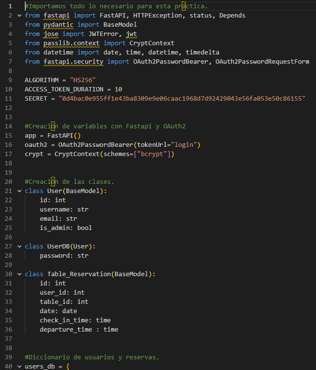
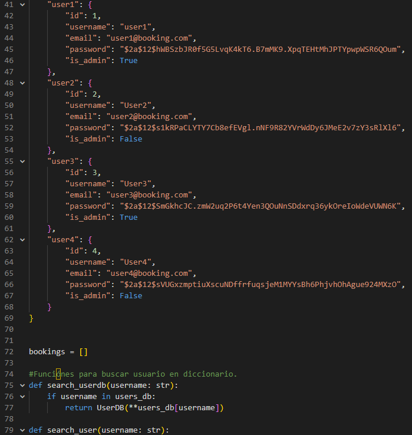
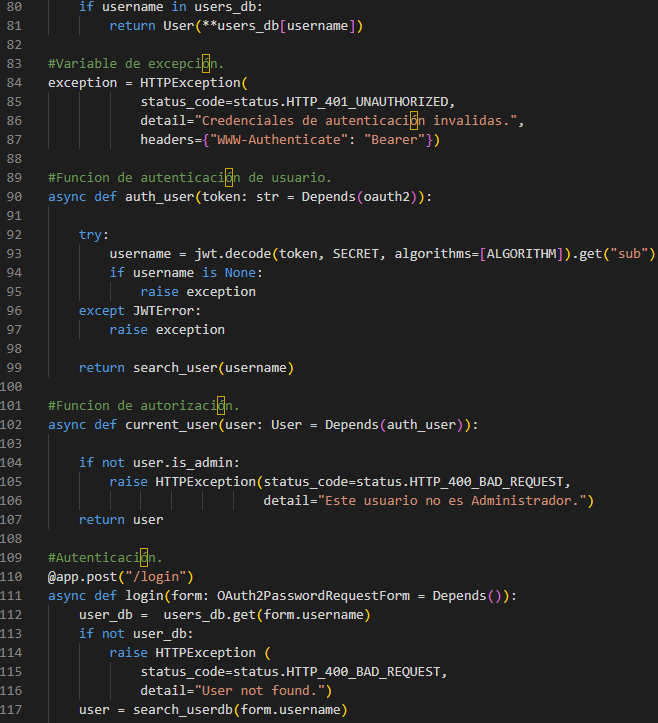
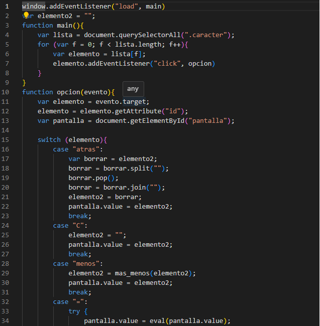
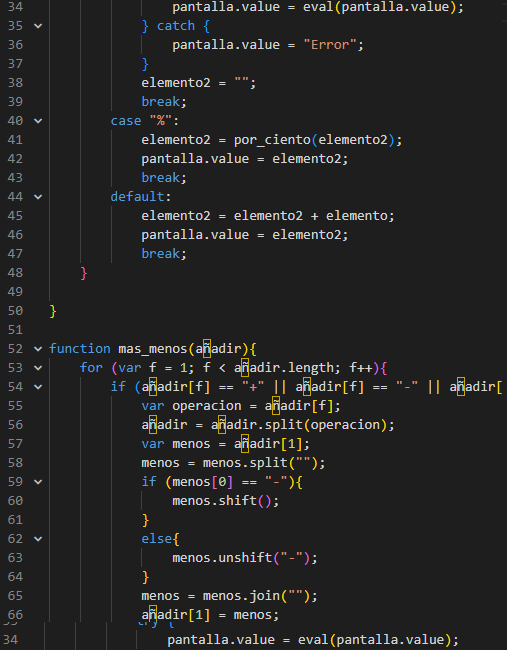
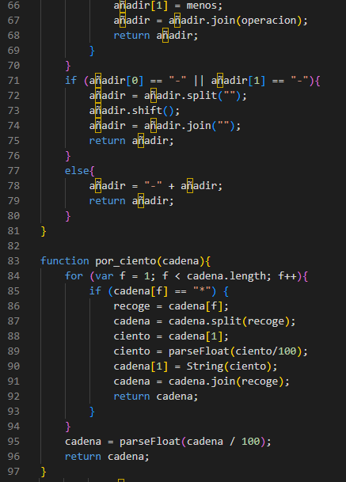
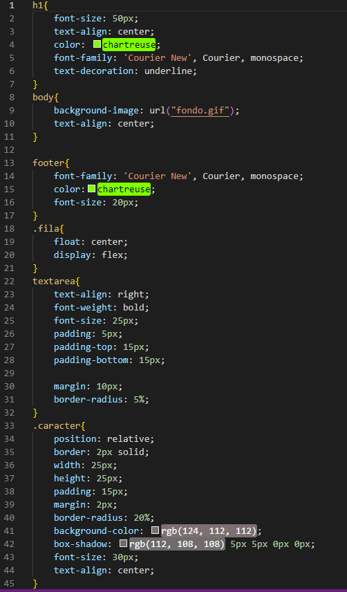

# Hola, mi nombre es Rafael Centella Guijarro👋

Técnico en Sistemas Microinformáticos y Redes 
aumentando sus capacidades y conocimientos en el 
Desarrollo de Aplicaciones Web, actualmente cursando
el primer año de este grado en el instituto Abdera.
Proximamente ire subiendo algunos proyectos y cursos
que me hayan ayudado.

## Conocimientos Adquiridos:

- Python 🐍
- Javascript
- Bash
- SQL
- Json
- CSS
- HTML
- XML
- Git 
  - Repositorios
  - GitHub 😺
- Mongo
  - Local
  - ATLAS
- FastAPI
  - CRUD
  - Autentication
  - Conexión con DataBase
- Google 
  - Sheet
  - Docs
  - Slide

## Herramientas más usadas:

1. Visual Studio Code ⌨
2. Xampp 📃
3. Virtual Box 💻
4. Packet-Tracer 📡
5. Star-UML ⭐
6. XML Copy Editor
7. Trello

## Ejemplos de bloques de código:

1. Python 🐍

2. Javascript

3. CSS

## Enlaces a mis perfiles:

<!--
**rafa-centella/rafa-centella** is a ✨ _special_ ✨ repository because its `README.md` (this file) appears on your GitHub profile.

Here are some ideas to get you started:

- 🔭 I’m currently working on ...
- 🌱 I’m currently learning ...
- 👯 I’m looking to collaborate on ...
- 🤔 I’m looking for help with ...
- 💬 Ask me about ...
- 📫 How to reach me: ...
- 😄 Pronouns: ...
- ⚡ Fun fact: ...
-->
